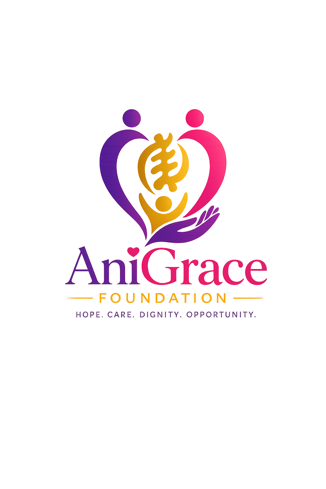
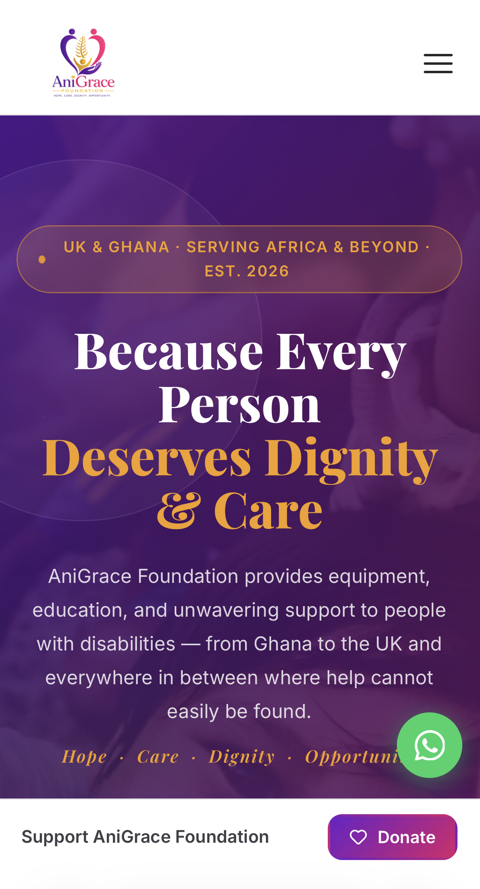
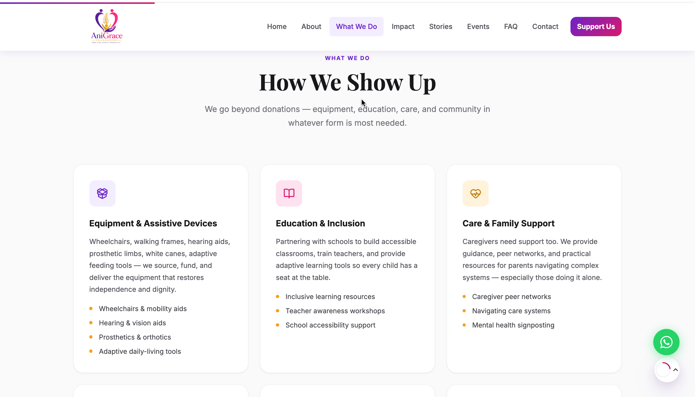
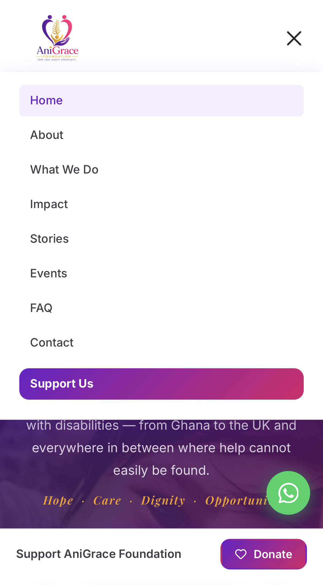
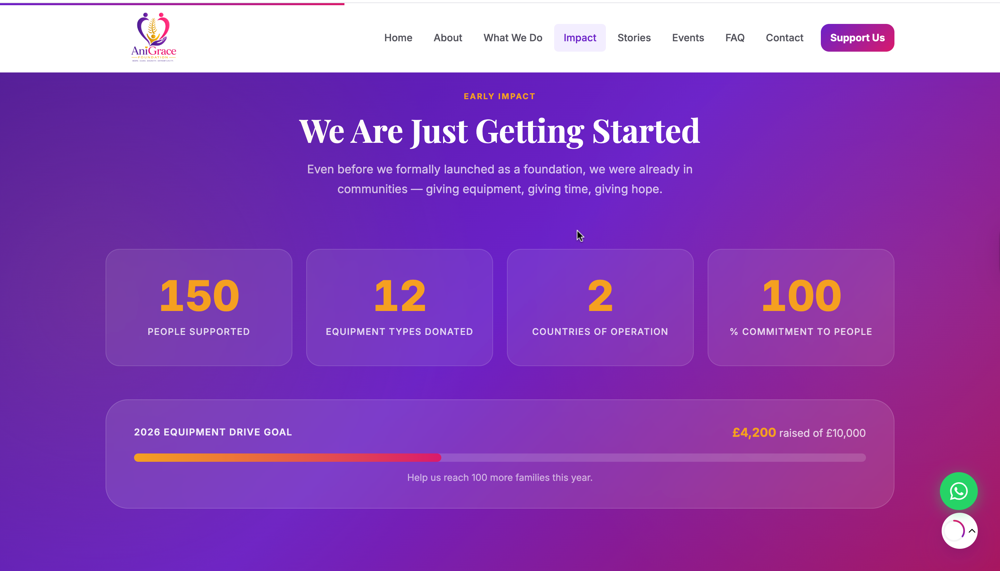
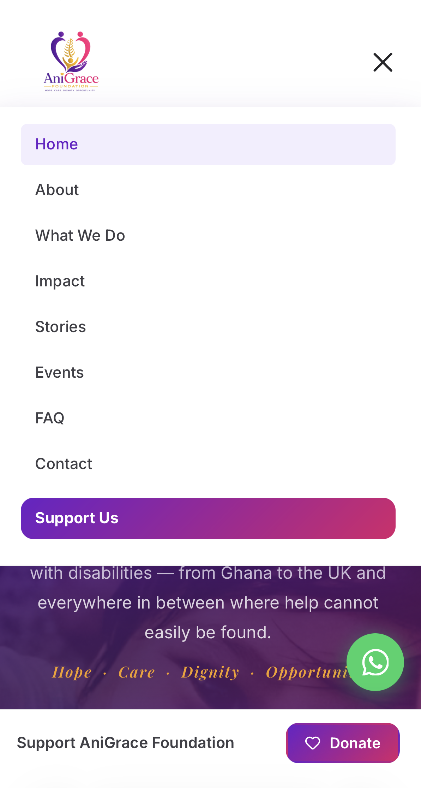
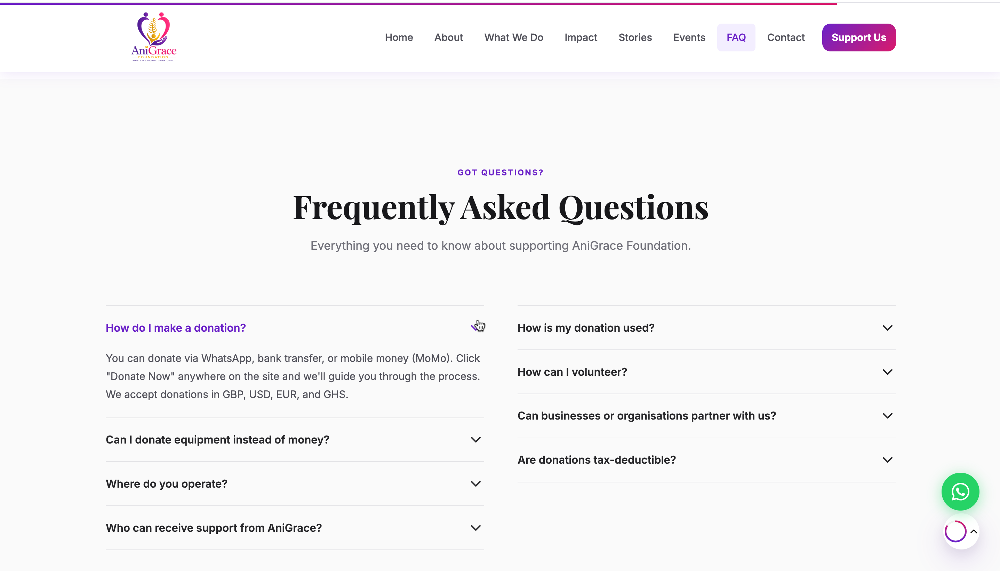

<div align="center">
  
  <h1>AniGrace Foundation</h1>
  <p><em>Hope. Care. Dignity. Opportunity.</em></p>

  
  
  
  
  
</div>

---

## Screenshots

| Desktop | Mobile |
|---------|--------|
|  |  |
|  |  |
|  |  |
|  | |


---

## About

The **AniGrace Foundation** is a UK-and-Ghana-based charity supporting people living with disabilities across Africa and beyond. Founded in 2026 by a mother raising a child with a disability, the Foundation goes beyond financial donations — providing wheelchairs, hearing aids, prosthetics, adaptive tools, education, caregiver support, and livelihood skills to those who cannot access them elsewhere.

We help wherever support is absent — mainly across Africa, but wherever need exists.

---

## Features

| Feature | Detail |
|---------|--------|
| Animated preloader | Logo pulse with graceful 1.9 s fade |
| Scroll progress bar | Gradient line across the top of the viewport |
| Sticky navbar | Always-white with shadow on scroll, active-link highlight |
| Hamburger menu | Fully accessible, closes on outside click or link tap |
| Hero section | Full-viewport, floating decorative shapes, dual CTA buttons |
| Founder strip | Personal story banner under the hero |
| About section | Mission + values with scroll-reveal cards |
| Programs grid | 6 programme cards with icons and hover lift |
| Impact band | Animated counters, live fundraising progress bar |
| Stories carousel | Auto-advance, swipe, dot navigation, 3-up → 1-up responsive |
| Partners strip | Logo row with grayscale-to-colour hover |
| Support / Donate | 4 donation tiers + custom amount + modal payment step |
| Events | Upcoming events with date badges |
| Testimonials | Quote cards from beneficiaries and volunteers |
| FAQ accordion | Two-column, single-open-per-column, smooth scroll |
| Newsletter signup | Email capture with validation |
| Contact form | Full validation, real-time error clearing, success toast |
| Footer | Full site map, social links, legal links, dynamic year |
| WhatsApp float | Direct deep-link to WhatsApp |
| Mobile sticky bar | Donate CTA slides up after 450 px scroll on mobile |
| Scroll-to-top | SVG circular progress ring, smooth scroll |
| Cookie consent | GDPR banner, localStorage persistence |
| Focus trap | Tab/Shift+Tab stays inside donate modal |
| Ripple effect | CSS ripple on all CTA buttons |
| Scroll reveal | IntersectionObserver fade-in for every major element |
| Structured data | JSON-LD NGO schema for Google Rich Results |
| SEO | `robots.txt`, Open Graph meta, Twitter Card meta |
| Accessibility | Skip link, ARIA labels, semantic HTML, `scroll-margin-top` anchor fix |

---

## Tech Stack

| Layer | Technology |
|-------|-----------|
| Markup | HTML5 (semantic) |
| Styles | CSS3 — custom properties, Grid, Flexbox, animations |
| Scripts | Vanilla JavaScript (ES2020, no framework) |
| Icons | [Lucide](https://lucide.dev/) via CDN |
| Fonts | Google Fonts — Inter (body) + Playfair Display (headings) |
| Hosting | GitHub Pages |
| Version control | Git (single contributor) |

No build step, no bundler, no Node.js required — open `index.html` in any browser.

---

## Project Structure

```
Disable-Kids-in-Ghana-Foundation-Website-main/
├── index.html          # Full single-page site (~950 lines)
├── css/
│   └── style.css       # All styles — design tokens, layout, animations (~910 lines)
├── js/
│   └── main.js         # All interactivity — carousel, modal, forms, counters (~380 lines)
├── assets/
│   ├── logo.PNG        # Foundation logo (used in nav, footer, favicon)
│   └── screenshots/    # Add your screenshots here
├── robots.txt          # SEO crawler rules + sitemap pointer
└── README.md           # This file
```

---

## Running Locally

No server or build step required:

```bash
# Clone the repository
git clone https://github.com/fredopoku/Disable-Kids-in-Ghana-Foundation-Website.git

# Open directly in your browser
open index.html          # macOS
start index.html         # Windows
xdg-open index.html      # Linux
```

Or drag `index.html` into any browser window.

---

## Deploying to GitHub Pages

1. Push all changes to the `main` branch
2. Go to **Settings → Pages** in the GitHub repository
3. Set **Source** to `main` branch, `/ (root)` folder
4. Click **Save** — the site goes live at `https://fredopoku.github.io/Disable-Kids-in-Ghana-Foundation-Website/`

### Custom Domain (optional)

1. Add a `CNAME` file to the repo root containing your domain (e.g. `anigracefoundation.org`)
2. Point your domain's DNS to GitHub Pages IPs: `185.199.108.153`, `185.199.109.153`, `185.199.110.153`, `185.199.111.153`
3. Enable **Enforce HTTPS** in GitHub Pages settings

---

## Before Going Live Checklist

- [ ] Replace placeholder phone numbers with real UK and Ghana numbers
- [ ] Replace `hello@anigracefoundation.org` with the live inbox address
- [ ] Update WhatsApp deep-link numbers (`wa.me/44…` and `wa.me/233…`)
- [ ] Confirm or remove partner organisation names and logos
- [ ] Confirm fundraising totals (£4,200 raised / £10,000 goal)
- [ ] Confirm impact stats (150+ people, 12 equipment types, 3 countries)
- [ ] Confirm event dates (July 19, September 6, October 10, 2026)
- [ ] Add `sitemap.xml` once domain is confirmed
- [ ] Add real screenshots to `assets/screenshots/`
- [ ] Wire up contact form to a real backend (Formspree, Netlify Forms, or EmailJS)
- [ ] Wire up newsletter form to Mailchimp / ConvertKit / similar

---

## Brand Colours

| Role | Hex | Swatch |
|------|-----|--------|
| Purple primary | `#6B21C8` |  |
| Purple dark | `#4C1799` |  |
| Pink secondary | `#D91A6B` |  |
| Pink dark | `#A8135A` |  |
| Gold accent | `#F5A020` |  |
| Brand gradient | `135deg #6B21C8 → #D91A6B` | — |

---

## Contact

| Channel | Detail |
|---------|--------|
| Website | [anigracefoundation.org](https://anigracefoundation.org) |
| Email | hello@anigracefoundation.org |
| GitHub | [fredopoku/Disable-Kids-in-Ghana-Foundation-Website](https://github.com/fredopoku/Disable-Kids-in-Ghana-Foundation-Website) |

---

<div align="center">
  <sub>Built with care for the AniGrace Foundation &copy; 2026. All rights reserved.</sub>
</div>
